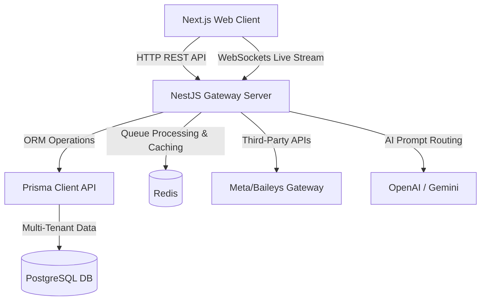

# VeloceAI: Enterprise WhatsApp Sales & Marketing Automation Platform

VeloceAI is a state-of-the-art, multi-tenant SaaS platform built to automate business-to-customer interactions over WhatsApp. The platform combines a NestJS backend and Next.js App Router frontend, featuring an AI abstraction layer, custom CRM Kanban pipelines, high-end visual workflow canvases, campaign analytics, billing systems, and superadmin management.

---

## System Architecture

The platform operates as a modern monorepo with clean service boundaries:



### Folder Structure
- `backend/`: NestJS workspace containing module files, services, DTO classes, and Prisma configurations.
- `frontend/`: Next.js workspace containing App Router routes, Tailwind design presets, Lucide icons, and API mock fallback clients.
- `docker-compose.yml`: Local infrastructure setup for PostgreSQL and Redis.

---

## 1. Database Schema (`backend/prisma/schema.prisma`)

The database utilizes PostgreSQL with a multi-tenant structure mapping tables by `organizationId` for RBAC safety:
- **`User` / `Organization` / `Membership`**: Multi-tenant RBAC core. Roles: `OWNER`, `ADMIN`, `AGENT`, `SUPERADMIN`.
- **`Contact` / `LeadStage` / `Tag` / `Note`**: CRM CRM system supporting pipelines, custom tags, and action alerts.
- **`WhatsAppLog` / `Conversation`**: WhatsApp message streams (role: `USER`, `ASSISTANT`, `SYSTEM`).
- **`Campaign` / `CampaignLog`**: Bulk scheduler broadcast records with click-through rate (CTR) log tracking.
- **`Workflow` / `WorkflowNode` / `WorkflowEdge` / `WorkflowRun`**: Drag-and-drop automation visual graph runner.
- **`Billing` / `UsageQuota`**: Quota meter limit tracking (messages, contacts, active canvasses) for Stripe checkouts.
- **`AuditLog` / `SystemMetric`**: Supervisory logging and resource utilization charts.

---

## 2. Backend API Routing Directory

| Module | Route Path | Method | Purpose | Role Allowed |
| :--- | :--- | :--- | :--- | :--- |
| **Auth** | `/api/auth/register` | `POST` | Create owner account & workspace | Public |
| | `/api/auth/login` | `POST` | Authenticate & retrieve JWT signature | Public |
| | `/api/auth/me` | `GET` | Retrieve session information | All |
| **CRM** | `/api/crm/contacts` | `GET`/`POST` | Fetch or add leads database | Agent+ |
| | `/api/crm/contacts/:id`| `PATCH`/`DELETE` | Modify or delete CRM contact | Agent+ |
| | `/api/crm/stages` | `GET`/`POST` | Fetch or define pipeline column stages | Admin+ |
| | `/api/crm/tags` | `GET`/`POST` | Fetch or create CRM label tags | Admin+ |
| **WhatsApp**| `/api/whatsapp/status` | `GET` | Get WhatsApp pairing connection status| Agent+ |
| | `/api/whatsapp/connect`| `POST` | Simulate QR code connection pairing | Admin+ |
| | `/api/whatsapp/send` | `POST` | Send outgoing manually-typed message | Agent+ |
| | `/api/whatsapp/simulate`| `POST` | Simulate incoming customer message | Agent+ |
| **AI** | `/api/ai/templates` | `GET` | Fetch preset copywriting blueprints | Agent+ |
| | `/api/ai/content` | `POST` | Generate copywriting templates via AI | Agent+ |
| | `/api/ai/smart-replies`| `GET` | Get automated reply suggestions | Agent+ |
| **Workflows**| `/api/workflows` | `GET`/`POST` | Fetch or create workflow templates | Admin+ |
| | `/api/workflows/:id/graph`| `PATCH` | Update node connections in builder | Admin+ |
| **Billing** | `/api/billing/subscription`| `GET` | Fetch organization plan limits & meters | Admin+ |
| | `/api/billing/checkout`| `POST` | Trigger Stripe mock checkout sequence | Admin+ |
| **Admin** | `/api/admin/metrics` | `GET` | Fetch Node server CPU/RAM telemetry | Superadmin |
| | `/api/admin/users` | `GET` | Retrieve all platform users | Superadmin |
| | `/api/admin/audits` | `GET` | Review system security logs | Superadmin |

---

## 3. Getting Started

### Prerequisites
- Node.js 18+
- Docker & Docker Compose

### Step 1: Clone and Set Up Workspace
Configure the backend and frontend environment files:
- Copy `backend/.env.example` to `backend/.env`
- Copy `frontend/.env.example` to `frontend/.env`

### Step 2: Spin Up Databases (Docker)
Launch PostgreSQL and Redis containers:
```bash
docker-compose up -d
```

### Step 3: Set Up NestJS Backend & Database Migrations
Open a new shell, navigate to the `backend` directory, and initialize:
```bash
cd backend
npm install
npx prisma migrate dev --name init
npx prisma db seed
npm run start:dev
```
*Note: Seeding creates default user accounts, lead stages, default billing plans, and AI prompts.*
- **Developer Login Credentials**: `admin@whatsaas.com` / `admin123`

### Step 4: Launch Next.js Frontend
Open a separate shell, navigate to the `frontend` directory:
```bash
cd frontend
npm install
npm run dev
```
Open [http://localhost:3000](http://localhost:3000) in your browser.

---

## 4. Evaluation in Offline Sandbox Mode

The frontend is built with a stateful sandbox routing module (`frontend/src/lib/api.ts`). If the NestJS backend server is not running or is offline:
1. Network requests are intercepted and routed to an in-memory client database.
2. Form submissions (creating campaigns, updating CRM lead cards, visual workflow editing, copywriting generators) will succeed and update dynamically inside the browser window.
3. Stripe checkouts will simulate successfully via simulated webhook notifications.

This allows evaluating the premium UX transitions, drag-and-drop mechanics, interactive dashboards, and simulated live chat consoles immediately without configuring PostgreSQL, Redis, or Node.js.
